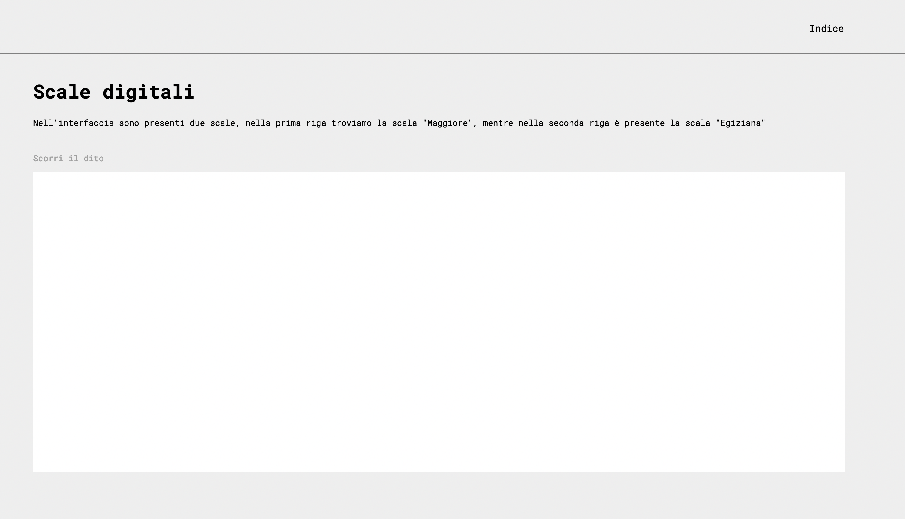
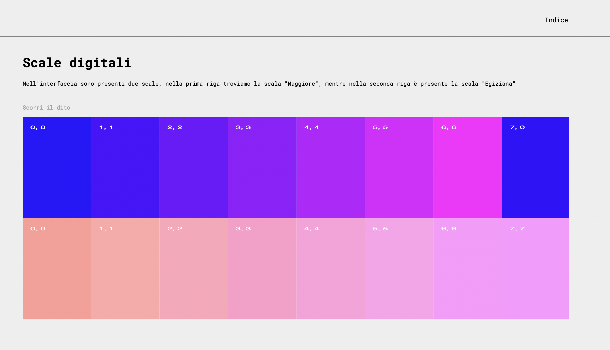
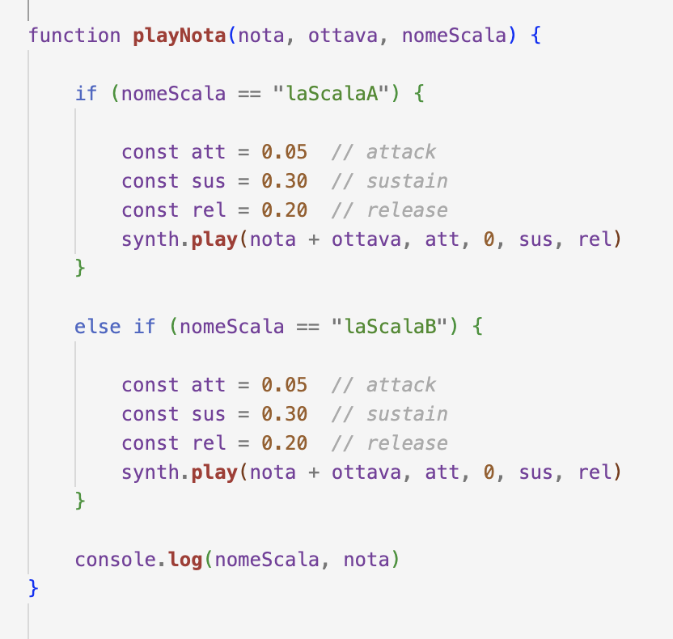
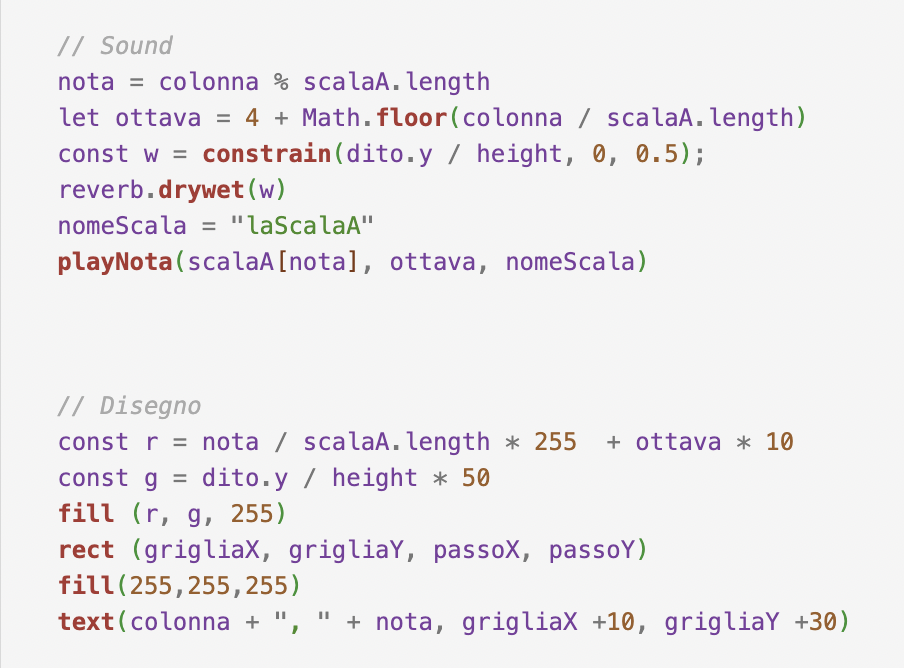
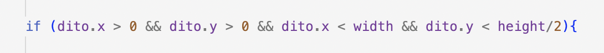

SUPSI 2022-23  
Corso d’interaction design, CV427.01  
Docenti: A. Gysin, G. Profeta  

Elaborato 3: Manipolazione 

# Manipolazione
Autore: Chiara Andreoli  
[Marionetta](https://andreolichiara.github.io/marionetta_gigi/)

## Introduzione e tema
Il compito assegnato era quello di realizzare
un sito con cui è possibile interagire tramite
le proprie mani, attraverso la computer vision.
Per quanto riguarda il mio progetto ho deciso di realizzare un'interfaccia tramite cui, utilizzando il dito indice, è possibile suonare delle scale musicali. All'interno del quadrato bianco, infatti, sono presenti due scale, nella riga superiore troviamo la scala "Maggiore", la quale parte dalla nota "Do". Mentre nella riga inferiore è presente una scala diversa, che parte da un'altra nota. 
In questo modo è possibile creare composizioni diverse. 

## Riferimenti progettuali
Per la realizzazione di questo progetto ho preso ispirazione da un esercizio svolto durante il corso. 

## Design dell’interfraccia e modalià di interazione
L'interfaccia realizzata presenta una home page lineare. In alto a destra è possibile trovare il tasto "Indice", mentre sotto si trova il titolo del progetto e una breve descrizione che spiega che scale sono presenti, e la scritta "scorri il dito" che invita a testare il prototipo.  

 

Le scale musicali inizialmente si presentano in un rettangolo bianco. Solo dopo che si muove il dito davanti alla videocamera, le scale prendono vita, iniziando a suonare e colorando i tasti sui quali ci si trova. 

 
Si trova anche una scritta all'interno di ogni tasto la quale indica la posizione in cui ci si trova.  

## Tecnologia usata
Per inserire il suono, inizialmente ho inserito le note musicali, successivamente attraverso la funzione "function playNota" ho modificato i parametri del suono.  
 

Dopodichè ho impostato la funzione "function setup" per le impostazioni del Canvas, background e per la videocamera.  

Infine ho inserito la funzione per inserire il marcatore del dito, così da utilizzare esclusivamente il dito indice per far suonare le scale. In questa parte ho definito sia il suono, che i colori dei vari tasti. 
 
 

Grazie alla regola sottostante ho potuto fra suonare due scale diverse nello stesso canvas.  
 

## Target e contesto d’uso
Il mio target di riferimento è abbastanza generico, infatti l'interfaccia è progettata sia per ragazi che per adulti, interessati all'ambito delle scale musicali.

